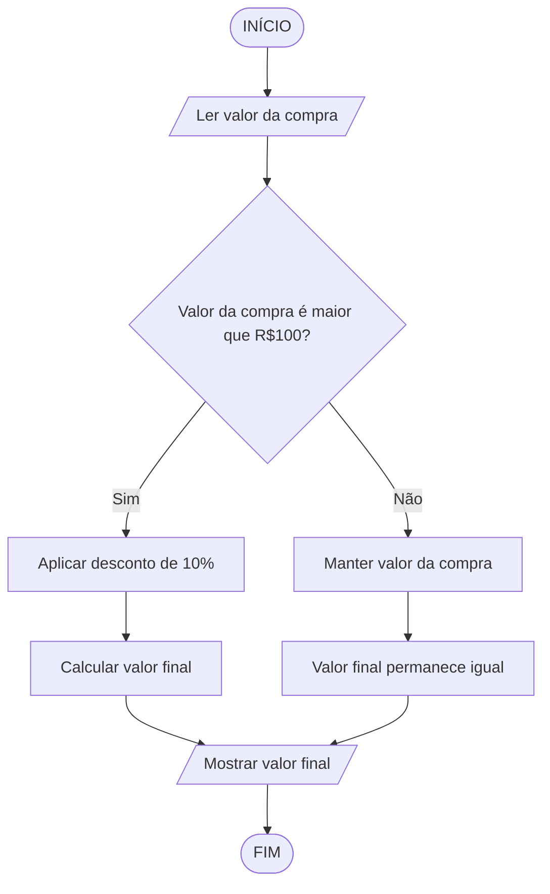

# Exercício 3 - Fluxograma
## Desconto de 10% em compras acima de R$100

## Legenda dos símbolos utilizados:

- **Oval** → Início / Fim
- **Paralelogramo** → Entrada / Saída (Ler / Mostrar)
- **Retângulo** → Processo / Cálculo
- **Losango** → Decisão (Sim / Não)