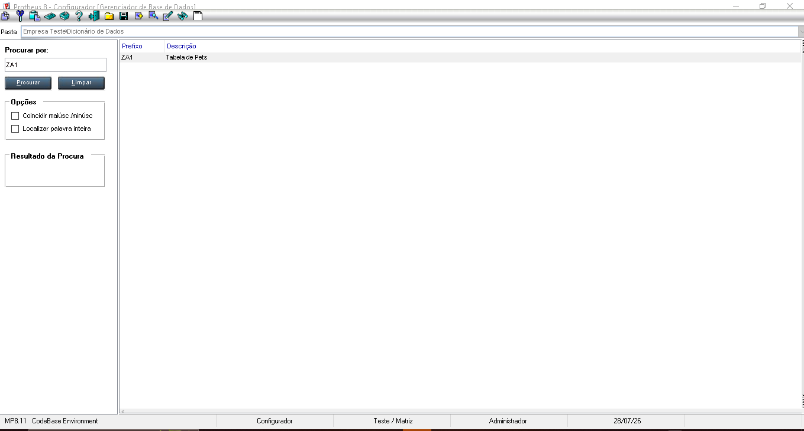
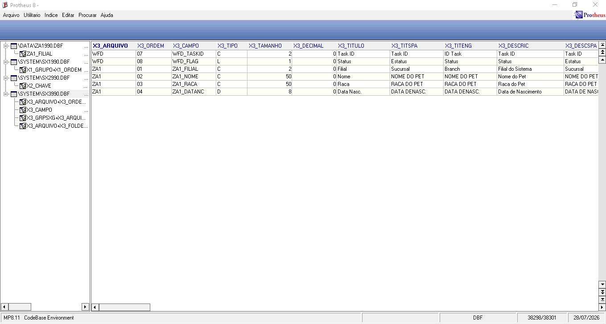

# Exercício 3 - Recriando a ZA1

Como acompanhei replicando a criação da tabela ZA1, utilizei ela como referência para este exercício.

Passos realizados:

1. Acessei o módulo Configurador (SIGACFG).

2. Abri o dicionário de dados e localizei a tabela ZA1 criada em aula.

3. Conferi se todos os campos estavam cadastrados corretamente:
   - ZA1_FILIAL
   - ZA1_NOME
   - ZA1_RACA
   - ZA1_DATANC

4. Verifiquei o índice da tabela, que ficou configurado pela filial, conforme realizado durante a aula.

5. Executei a rotina para que o framework reconhecesse a tabela.

6. Por fim, conferi a estrutura da ZA1 no MPSDU para confirmar que a tabela e seus campos estavam corretos.

Como evidência, anexei os prints da estrutura da tabela no Configurador e da consulta no MPSDU.

## Evidências

Print da tabela ZA1 no Configurador:

Print da estrutura da ZA1 no MPSDU:

