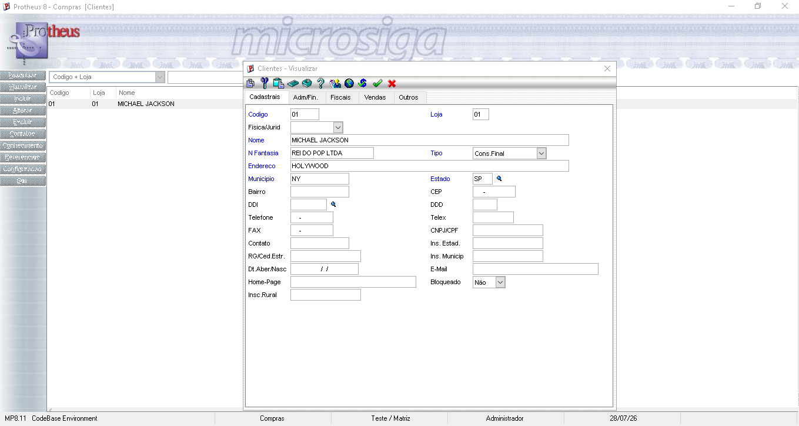

# Exercício 4 - Campo customizado na SA1

Neste exercício foi criado um novo campo na tabela SA1 (Cadastro de Clientes), seguindo o mesmo padrão utilizado em aula com o campo A1_VOVO.

O campo criado foi:

**A1_XAPELID - Apelido do cliente**

Passos realizados:

1. Acessei o Configurador (SIGACFG).

2. Localizei a tabela SA1 no dicionário de dados.

3. Criei o campo A1_XAPELID com o tipo Caracter, tamanho 20 e título Apelido.

4. Configurei o campo para aparecer no cadastro de clientes.

5. Salvei as alterações e atualizei o ambiente para que o Protheus reconhecesse o novo campo.

6. Acessei o cadastro de clientes pelo SmartClient e conferi o novo campo criado.

Como evidência, utilizei o cliente criado durante a aula, **Michael Jackson**, mostrando que o campo **Apelido** aparece na aba **Outros** do cadastro de clientes e está sendo solicitado como campo obrigatório.

Anexei o print do cadastro do cliente mostrando o campo A1_XAPELID preenchido/solicitado na tela.

## Evidências

Cliente criado durante a aula (Michael Jackson):

Campo A1_XAPELID aparecendo na aba Outros do cadastro:

