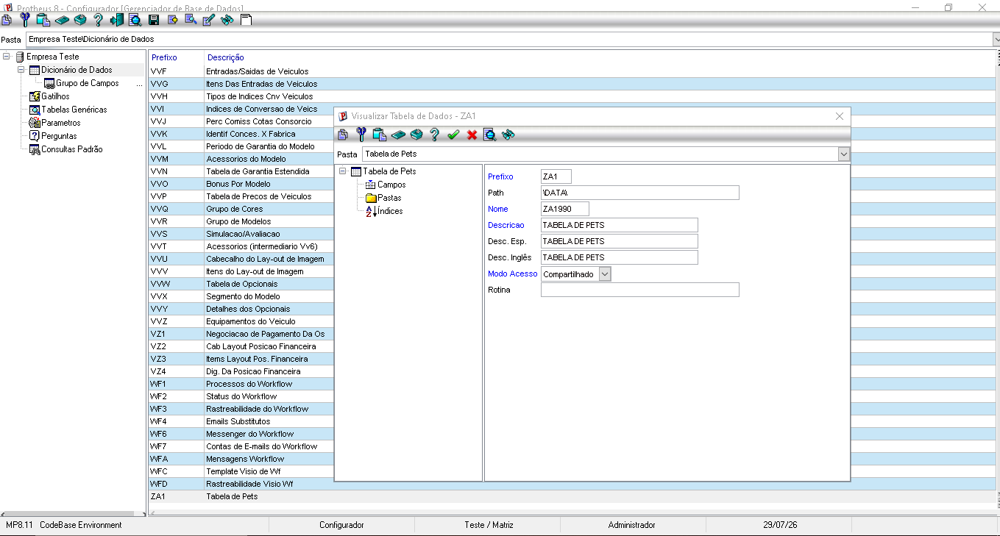
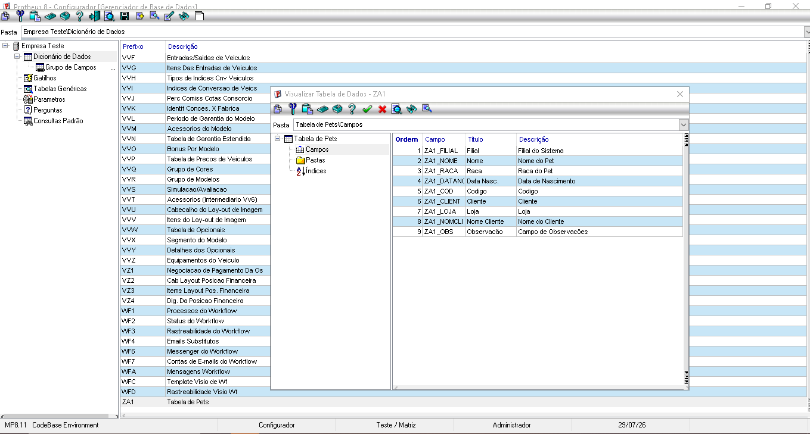
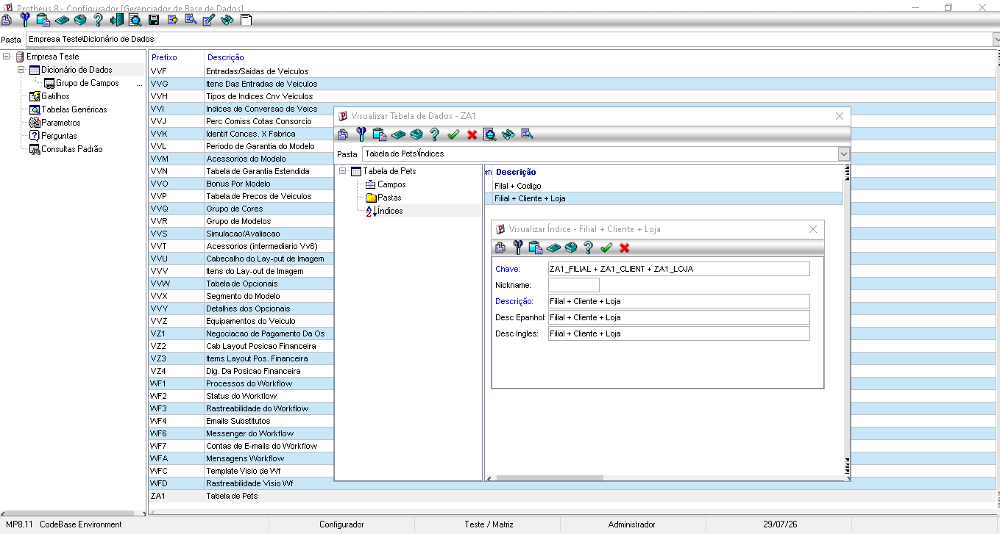

# Exercício 2 - Tabela ZA1

## Objetivo

Neste exercício completei a configuração da tabela ZA1 (Pets) no Configurador do Protheus.

Foram criados e configurados os campos da tabela, incluindo o campo virtual **ZA1_NOMCLI**, responsável por buscar automaticamente o nome do cliente da tabela SA1 utilizando a função `POSICIONE()`.

Também foram configurados os índices solicitados na atividade para permitir a identificação do registro e o relacionamento entre o pet e seu dono.

## Índices configurados

- Índice 1: `ZA1_FILIAL + ZA1_COD`
- Índice 2: `ZA1_FILIAL + ZA1_CLIENT + ZA1_LOJA`

## Evidências

As imagens abaixo mostram a configuração realizada:

- SX2 - Cadastro da tabela ZA1. 

- SX3 - Campos da tabela ZA1.

- SIX - Índice 1 da tabela ZA1.

- SIX - Índice 2 da tabela ZA1.
