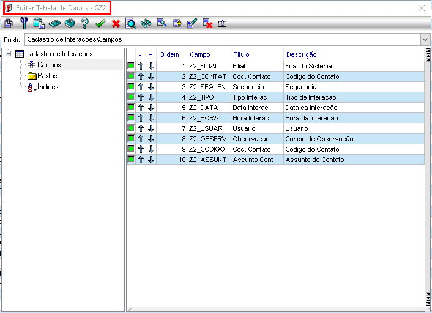
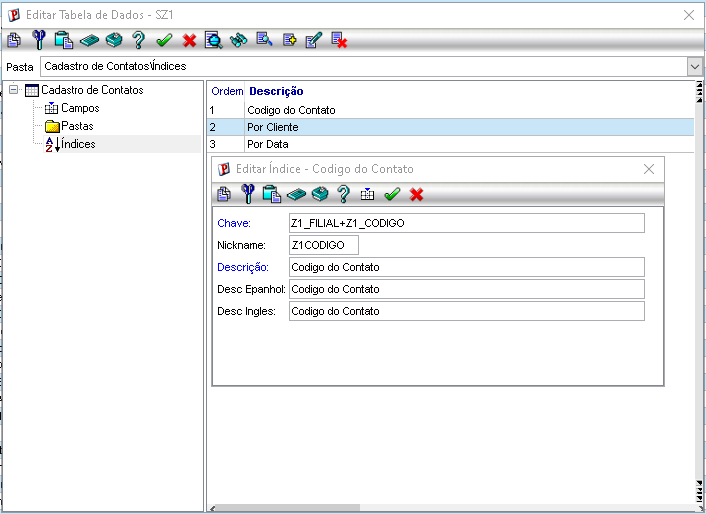
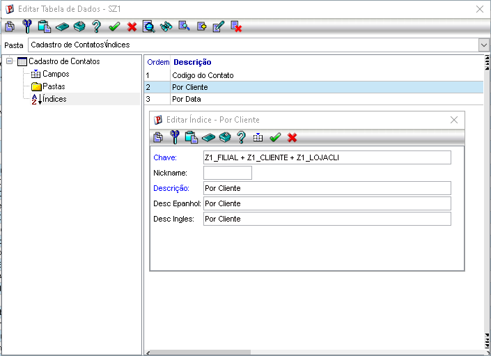
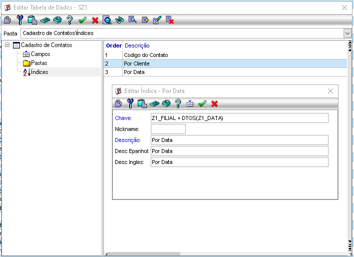
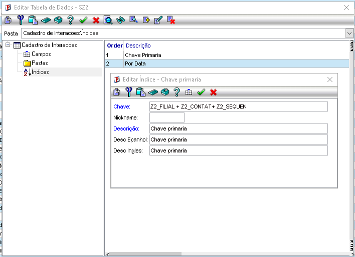

# Exercício 01 — Dicionário de Dados (SZ1 e SZ2)

## SX2 — Tabelas

Configuração das tabelas do projeto:

- SZ1 — Contatos
- SZ2 — Interações

## SX3 — Campos SZ1

Campos cadastrados para a tabela de Contatos:

- Z1_FILIAL
- Z1_CODIGO
- Z1_CLIENTE
- Z1_LOJACLI
- Z1_NOME
- Z1_ASSUNTO
- Z1_DATA
- Z1_HORA

## SX3 — Campos SZ2

Campos cadastrados para a tabela de Interações:

- Z2_FILIAL
- Z2_CONTAT
- Z2_SEQUEN
- Z2_TIPO
- Z2_DESCRI
- Z2_DATA
- Z2_HORA
- Z2_USUAR
- Z2_OBSERV
- Z2_CODIGO
- Z2_ASSUNT

## SIX — Índices SZ1

Índices cadastrados para a tabela de Contatos:

- Ordem 1: Z1_FILIAL + Z1_CODIGO

- Ordem 2: Z1_FILIAL + Z1_CLIENTE + Z1_LOJACLI

- Ordem 3: Z1_FILIAL + DTOS(Z1_DATA)

## SIX — Índices SZ2

Índices cadastrados para a tabela de Interações:

- Ordem 1: Z2_FILIAL + Z2_CONTAT + Z2_SEQUEN

- Ordem 2: Z2_FILIAL + DTOS(Z2_DATA)

## SX5 — Domínio dos tipos de interação

Tabela genérica para os tipos de interação:

| Chave | Descrição |
|---|---|
| E | E-mail |
| L | Ligação |
| R | Reunião |
| V | Visita |
| W | WhatsApp |

> Pendente de configuração no ambiente Protheus.